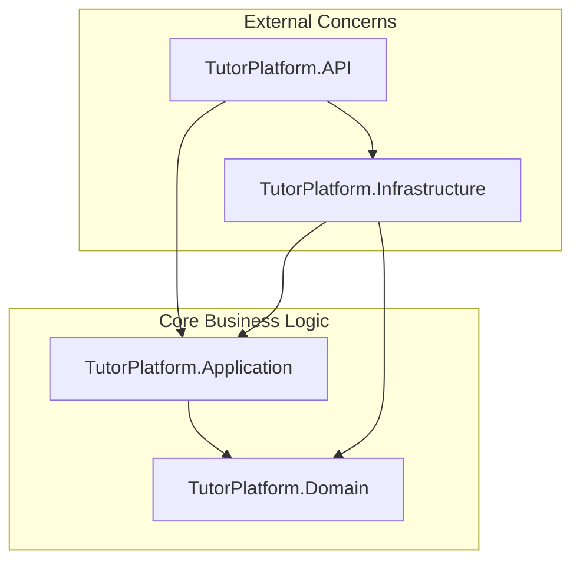

# 🎓 TutorPlatform - Nền Tảng Kết Nối Gia Sư & Học Viên (Backend API)

[](https://dotnet.microsoft.com/)
[](https://blog.cleancoder.com/uncle-bob/2012/08/13/the-clean-architecture.html)
[](https://github.com/jbogard/MediatR)
[](https://www.microsoft.com/sql-server)
[](https://azure.microsoft.com/)
[](https://vnpay.vn/)
[](https://www.brevo.com/)

---

## 🌐 Live Demo & Deployed Applications (Trải Nghiệm Trực Tiếp)

| Nền tảng (Platform) | Trạng thái (Status) | Đã Deploy (Live URL Access) |
| :--- | :---: | :--- |
| **🎨 Frontend Web App (Vercel)** |  | 👉 **[https://tutormatching-platform.vercel.app](https://tutormatching-platform.vercel.app)** |
| **⚙️ Backend RESTful API (Azure)** |  | 👉 **[Swagger API Docs trên Azure](https://tutorplatform-api-2026-a7bcgbcehfcedtg7.eastasia-01.azurewebsites.net/swagger)** |
| **🗄️ Database (Azure SQL Server)** |  | `sqlserver-tutor-2026.database.windows.net` |

---

## 📌 Giới Thiệu Dự Án

**TutorPlatform** là hệ thống Backend RESTful API hiện đại được xây dựng trên nền tảng **.NET 10**, áp dụng kiến trúc **Clean Architecture** chuẩn nguyên lý và mô hình **CQRS (Command Query Responsibility Segregation)** kết hợp **MediatR**. 

Hệ thống cung cấp giải pháp toàn diện cho việc kết nối giữa Gia sư (Tutor), Học viên (Student) và Ban quản trị (Admin), hỗ trợ đặt lịch học thông minh, thanh toán trực tuyến qua VNPAY, xác thực bảo mật OTP qua Brevo Email, SignalR Real-time Notifications và quản trị nâng cao.

---

## 🏛️ Kiến Trúc Hệ Thống (Clean Architecture)

Dự án được phân chia thành 4 phân tầng độc lập theo nguyên lý Dependency Inversion:



| Phân tầng (Layer) | Trách nhiệm chính |
| :--- | :--- |
| **`TutorPlatform.Domain`** | Chứa Entities, Enums, Interfaces cốt lõi và các Domain Logic độc lập, không phụ thuộc vào framework nào. |
| **`TutorPlatform.Application`** | Chứa Use Cases theo mô hình CQRS (Commands, Queries, Handlers), FluentValidation, DTOs và Business Services. |
| **`TutorPlatform.Infrastructure`** | Cấu hình Entity Framework Core, SQL Server, Repositories, tích hợp VNPAY, Brevo Email Service và Background Hosted Services. |
| **`TutorPlatform.API`** | Cung cấp Controllers RESTful API, Swagger OpenAPI, Global Exception Handler, Middleware JWT Authentication, SignalR Hubs, CORS. |

---

## ✨ Tính Năng Nổi Bật

### 🔐 1. Xác thực & Bảo mật (Authentication & Security)
- Đăng ký, đăng nhập tài khoản (Student, Tutor, Admin) với mã hóa mật khẩu **BCrypt**.
- Cơ chế **JWT Authentication** (Access Token + Refresh Token).
- **Quên mật khẩu & Đặt lại mật khẩu** qua mã OTP bảo mật gửi trực tiếp đến Email thật qua **Brevo API**.

### 👨‍🏫 2. Quản lý Gia Sư (Tutor Management)
- Đăng ký và cập nhật hồ sơ năng lực gia sư (Bio, Bằng cấp, Môn dạy).
- Thiết lập khung giờ dạy linh hoạt (Tutor Availability).
- Quản trị viên duyệt / từ chối hồ sơ gia sư minh bạch.

### 📅 3. Đặt Lịch & Học Tập (Booking & Learning Flow)
- Tìm kiếm gia sư thông minh theo môn học, khung giờ, mức giá và đánh giá.
- Đặt lịch học theo buổi (1 kèm 1 hoặc nhóm).
- Kiểm tra chống trùng lịch tự động (Overlapping booking prevention).
- Đánh giá (Review & Rating) sau khi hoàn thành buổi học.

### 💳 4. Tín Dụng & Thanh Toán (Credits & Payments)
- Tích hợp cổng thanh toán trực tuyến **VNPAY Sandbox**.
- Hệ thống nạp Credit và khấu trừ tự động khi xác nhận buổi học.
- Quản trị viên theo dõi yêu cầu nạp tiền và đối soát giao dịch.

### 🔔 5. Thông Báo Thời Gian Thực (SignalR Real-time Notifications)
- Tích hợp **SignalR Hub** đẩy thông báo biến động số dư, kết quả duyệt hồ sơ gia sư và lịch học mới tức thì tới người dùng mà không cần reload lại trang.

### 📊 6. Bảng Điều Khiển Quản Trị (Admin Dashboard & Analytics)
- Báo cáo thống kê tổng thể: Người dùng, Gia sư chờ duyệt, Doanh thu hệ thống.
- Báo cáo doanh thu chi tiết phân tích theo Tháng, Quý, Năm với biểu đồ tăng trưởng.

### ⏱️ 7. Tự Động Hóa (Background Services)
- `OverdueClassNotifierService`: Background Service chạy định kỳ tự động quét và gửi thông báo nhắc nhở các buổi học quá hạn.

---

## 🛠️ Công Nghệ & Thư Viện Sử Dụng

- **Framework**: .NET 10 Web API
- **ORM & Database**: Entity Framework Core 10, Microsoft Azure SQL Server
- **Architecture & Patterns**: Clean Architecture, CQRS, Repository & Unit of Work Pattern
- **Mediator**: MediatR
- **Real-time Engine**: ASP.NET Core SignalR
- **Validation**: FluentValidation
- **Authentication**: JWT Bearer, BCrypt.Net-Next
- **Payment Gateway**: VNPAY.NET SDK
- **Email Service**: Brevo API (Sendinblue)
- **API Documentation**: Swagger / OpenAPI
- **CI/CD & Hosting**: GitHub Actions, Azure App Service (Linux)

---

## 🚀 Hướng Dẫn Cài Đặt & Chạy Cục Bộ

### 1. Yêu cầu môi trường
- [.NET 10.0 SDK](https://dotnet.microsoft.com/download/dotnet/10.0)
- [Microsoft SQL Server](https://www.microsoft.com/sql-server) (LocalDB hoặc SQL Server Instance / Azure SQL)
- Visual Studio 2022 / JetBrains Rider / VS Code

### 2. Cài đặt các bước
```bash
# 1. Clone repository
git clone https://github.com/NguyendDucTai/TutorMatchingPlatform.git
cd TutorMatchingPlatform

# 2. Cập nhật Connection String trong TutorPlatform.API/appsettings.json
# "DefaultConnection": "Data Source=YOUR_SERVER;Initial Catalog=TutorPlatformDb;Integrated Security=True;Trust Server Certificate=True"

# 3. Khôi phục packages & Build dự án
dotnet restore
dotnet build

# 4. Khởi chạy Backend API
dotnet run --project TutorPlatform.API
```

API sẽ hoạt động tại: `http://localhost:5000`  
Giao diện Swagger tài liệu API: `http://localhost:5000/swagger`

---

## 🌳 Quy Ước Nhánh Git (Git Flow)

Để giữ cho repository gọn gàng và chuyên nghiệp:
- `main` / `master`: Nhánh chính dành cho Production.
- `develop`: Nhánh tích hợp cho môi trường phát triển / Staging.

---

## 👤 Tác Giả & Đóng Góp (Authors)

- **Nguyễn Đức Tài** (Lead Backend Developer) - Email: `nguyenductai08102004@gmail.com`